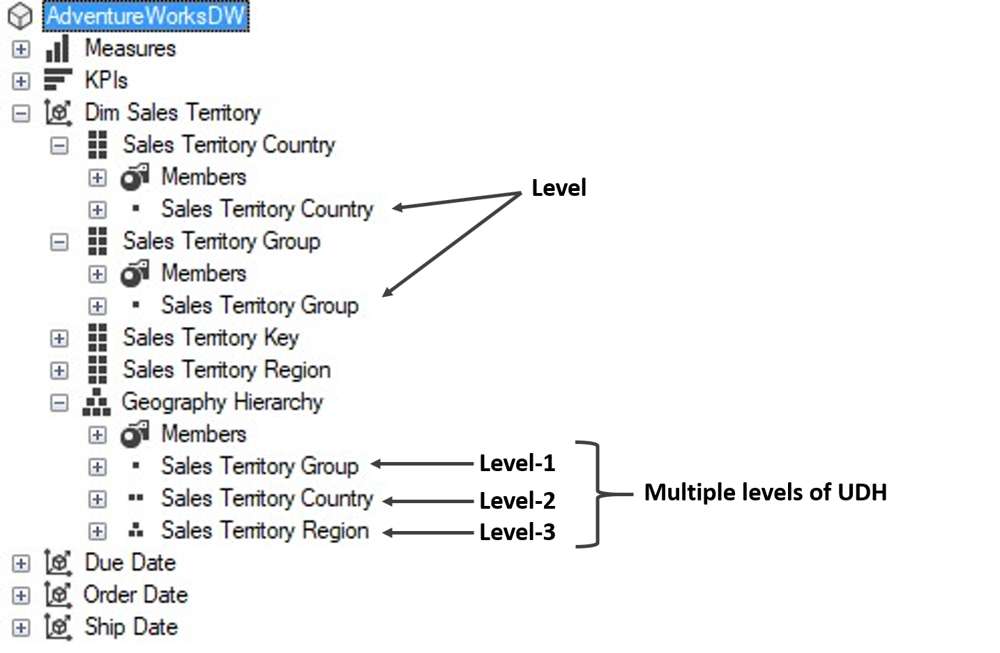
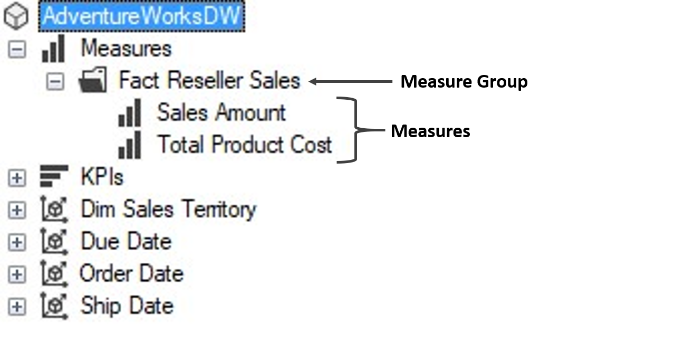

# Cube Structure

A typical cube structure has a **measure** axis and some **dimension** axis as shown in the below image :

Let's expand each of these axes to see their respective granularity

## Dimension Axis

Now, if we open any of the dimension axis then, we can see the following structure :

Inside a dimension axis we basically two types of hierarchies :
1. Attribute / Attribute Hierarchy
2. User Defined Hierarchy (UDH)

Now if we expand hierarchies, we can observe a similar structure as follows :

From the above image, it is clear that

- Each attribute consists a single level
- Each UDH consists multiple levels.

Moving further, if we expand any level then, we reach to the most granular level, i.e., **Members** as shown in the below image -:

## Measure Axis

Upon expanding the measures axis, we see some **measure groups** and under each measure group, we have certain number of **measures** as shown in the below image :

 
